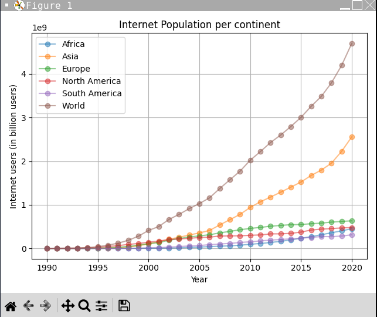

# python-data-visualization

## 📌 Description
This project reads population data from a CSV file and visualizes the internet population per continent over time using Matplotlib. It processes data into a structured dictionary format and generates line plots for each continent, showing trends in internet users over different years.

## 🛠 Prerequisites
Before running the project, ensure you have the following installed:
* Python 3.x
* Matplotlib

## 📋 Criteria
* Reads and processes CSV data into a structured dictionary
* Generates clear, labelled line plots
* Displays trends in internet population per continent
* Handles multiple continents dynamically

## 💻 Technologies Used
The application is built with the following technologies:
* Python
* Matplotlib
* CSV (Comma-Separated Values)

## 🚀 Installation
No installation is required to use the app. It is hosted online and can be accessed via a web browser.

## 📚 Usage
1. Make sure you have CSV file (data.csv)
2. Run the script
3. The script will generate a line plot visualizing internet population trends.

## 🔗 Live Demo & Repository
Application can be viewed here: 
* [Live](https://replit.com/@yvonnesarah/Python-Data-Visualization)

* [Repository](https://github.com/yvonnesarah/python-data-visualization)

## 🖼 Screenshot
Below is a preview of Python Data Visualization:

## 👥 Credit
N/A

## 📜 License
This project is open-source. For licensing details, please refer to the LICENSE file in the repository.

## 📬 Contact
You can reach me at 📧 yvonneadedeji.sarah@gmail.com.
